# Procesverslag
Markdown is een simpele manier om HTML te schrijven.  
Markdown cheat cheet: [Hulp bij het schrijven van Markdown](https://github.com/adam-p/markdown-here/wiki/Markdown-Cheatsheet).

Nb. De standaardstructuur en de spartaanse opmaak van de README.md zijn helemaal prima. Het gaat om de inhoud van je procesverslag. Besteedt de tijd voor pracht en praal aan je website.

Nb. Door *open* toe te voegen aan een *details* element kun je deze standaard open zetten. Fijn om dat steeds voor de relevante stuk(ken) te doen.

## Jij

  
uitwerken voor kick-off werkgroep

  ### Auteur:
  Sam van der Hoorn

  #### Je startniveau:
  blauw/rood. Ik leer het vaak wel snel maar na zo'n lange periode zonder te coderen merk ik dat het wel weer heel erg wennen en opnieuw leren is.

  #### Je focus:
  Ik ga focussen op het responsive maken van mijn website. Ik heb dit nog nooit gedaan en weet eigenlijk niet zo goed hoe dit precies werkt, animaties heb ik vaker gebreukt en zie ik momenteel niet zo zeer als een uitdaging als ik het vergelijk met het responsive maken van mijn website. Ik heb hiervoor gekozen omdat ik er meer van kan leren en ik benieuwd ben hoe dit precies werkt, ondanks dat ik denk dat het een stuk meer tijd gaat kosten dan het maken van animaties.

 

## Je website

  
uitwerken voor kick-off werkgroep

  ### Je opdracht:
  Ik ga de website van Poké Perfect namaken: https://pokeperfect.nl/ 

  #### Screenshot(s) van de eerste pagina (small screen): 
  De Poké Perfect Homepage:
  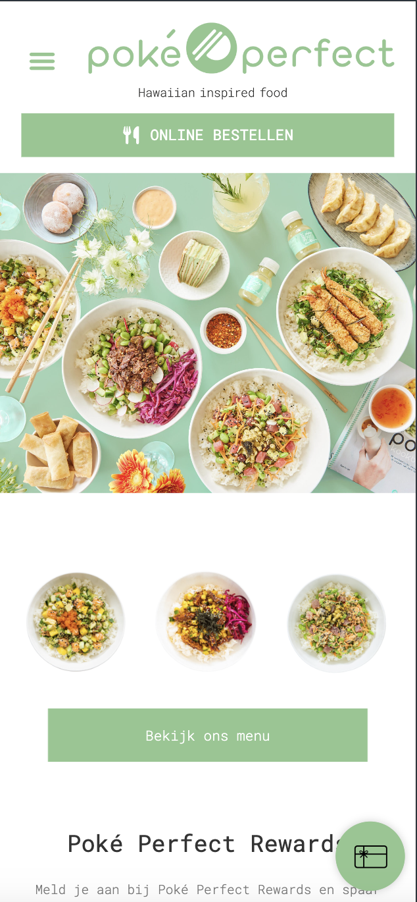
  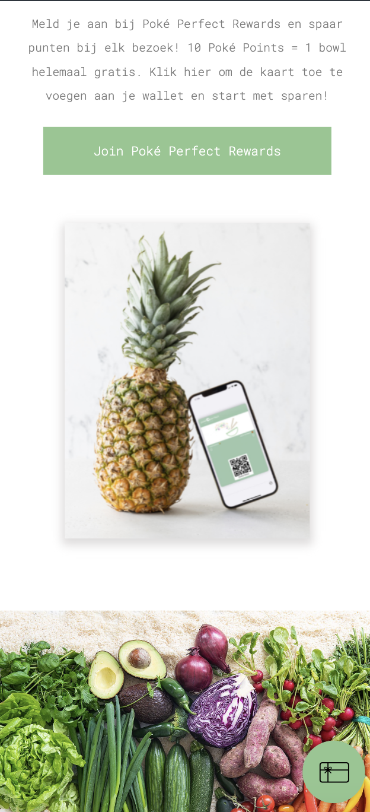
  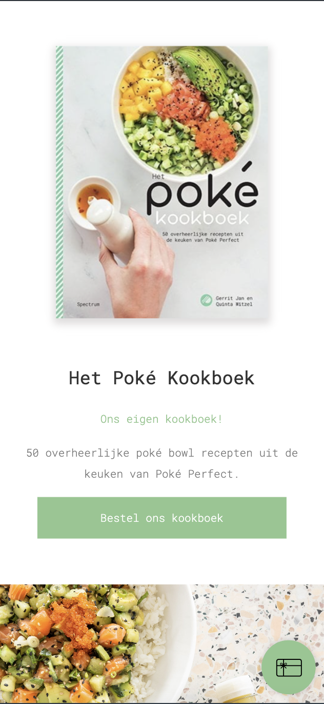
  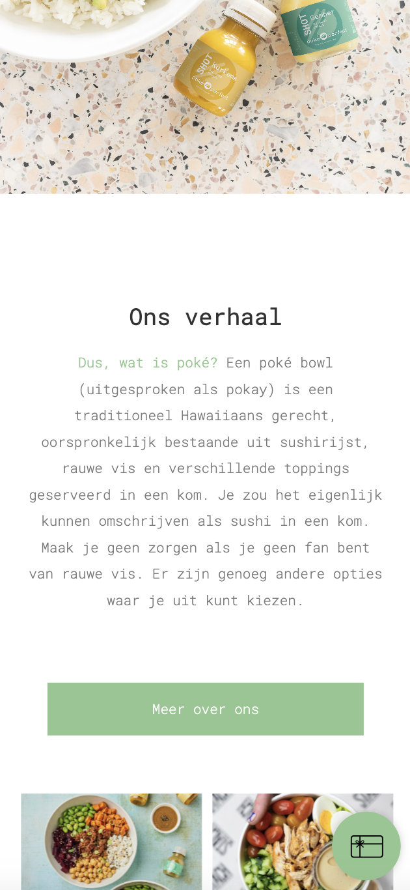
  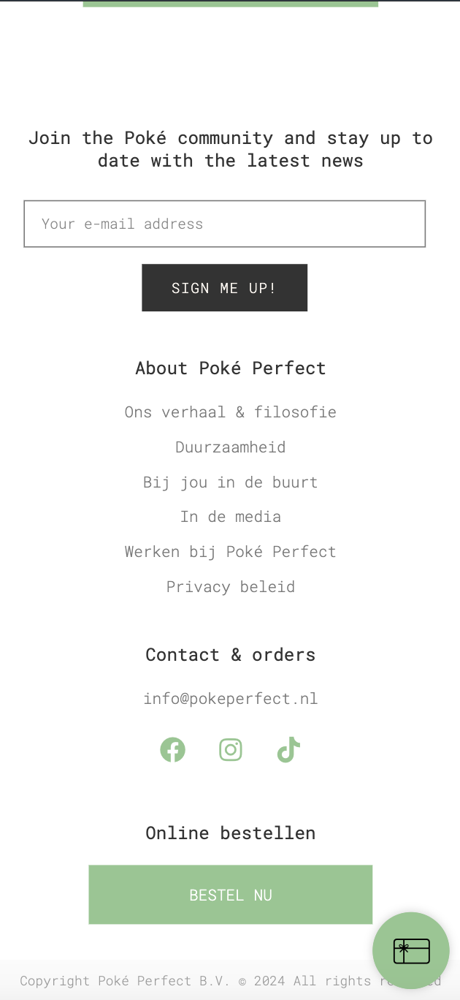
  

  #### Screenshot(s) van de tweede pagina (small screen):
  De Poké Perfect Menu-pagina: 
  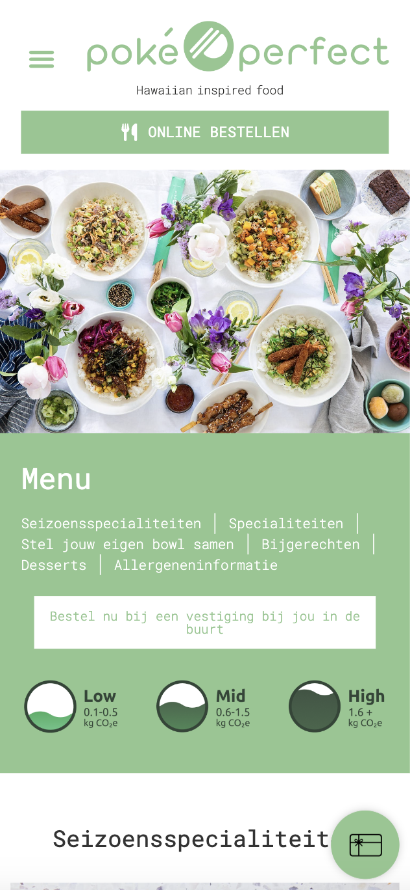
  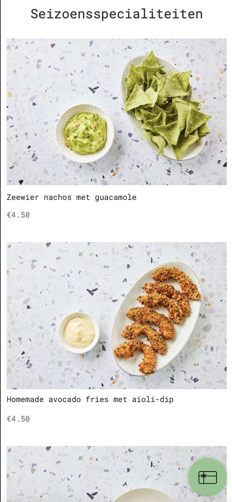
  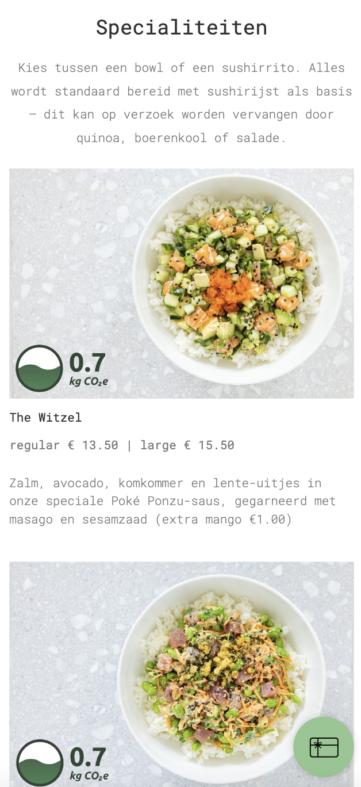
  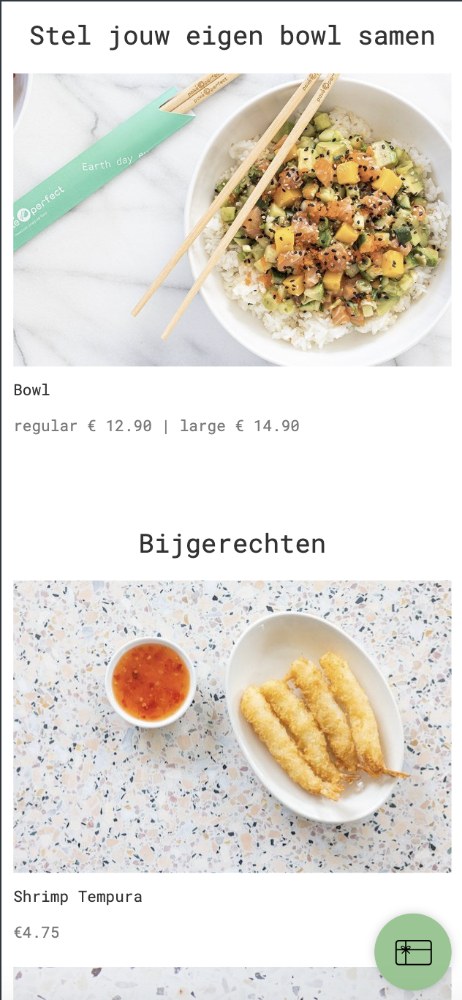
  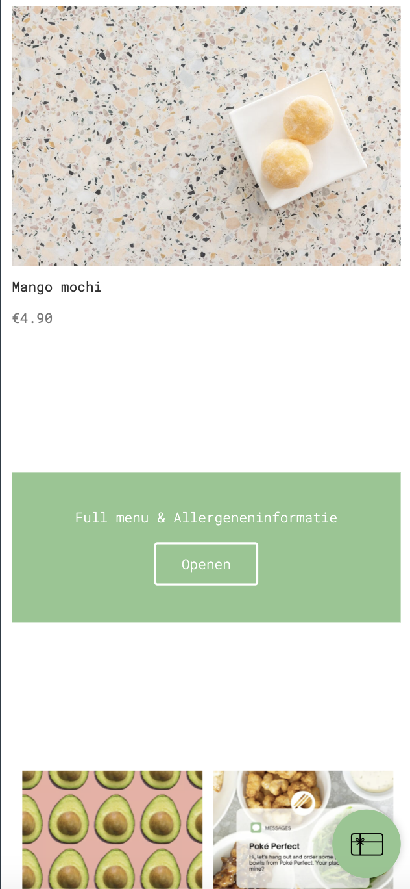

 

## Toegankelijkheidstest 1/2 (week 1)

  
uitwerken na test in 2e werkgroep

  ### Bevindingen
  Lijst met je bevindingen die in de test naar voren kwamen:

Over het algemeen was de website redelijk goed te navigeren met de screenreader, maar ik kwam toch tegen problemen aan. Hoewel de structuur van de site in de meeste gevallen logisch is opgebouwd, was de voice-over niet altijd even duidelijk. Dit zag je vooral bij buttons die in het Engels waren geschreven, terwijl de lang="nl"-attribute werd gebruikt. Hierdoor werden Engelse zinnen zoals "Join Poké Perfect" met een zwaar Nederlands accent uitgesproken, dit was slecht te verstaan.

Een ander punt dat opviel, is dat bepaalde elementen (zoals knoppen en formulieren) niet altijd goed werden aangekondigd door de screenreader. Soms werd er geen duidelijke indicatie gegeven dat een element klikbaar was, of werd de functie van de knop niet juist beschreven. 

Daarnaast waren er momenten waarop ik moeite had om het overzicht te behouden. Het bedienen van de site met de screenreader vond ik persoonlijk heel lastig en onduidelijk.. Dit kan deels komen door een gebrek aan ervaring hiermee, maar ik vond het niet altijd even soepel gaan.

 

## Breakdownschets (week 1)

  
uitwerken na afloop 3e werkgroep

  ### de hele pagina: 

  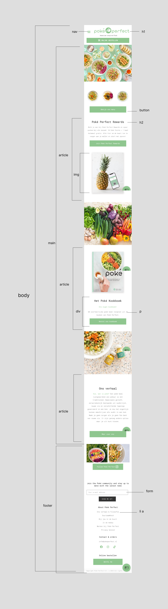

  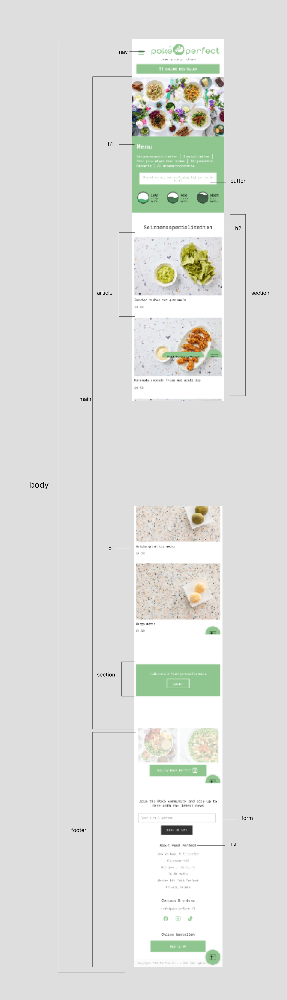

  ### dynamisch deel (bijv menu): 
  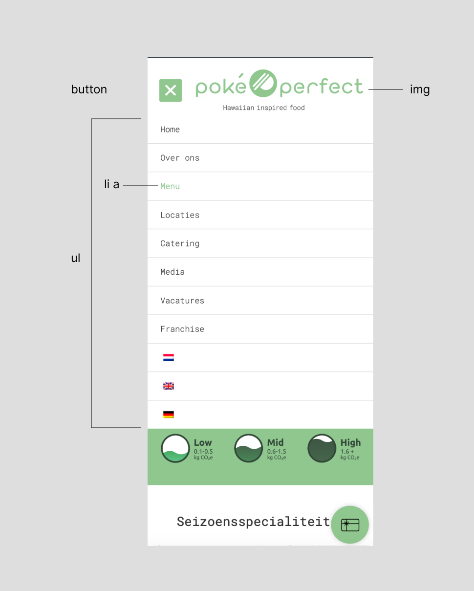

## Voortgang 1 (week 2)

  
uitwerken voor 1e voortgang

  ### Stand van zaken
  Ik heb geoefend met de opdrachten uit de les. Dit gaat steeds erg goed, ik ben benieuwd hoe dit gaat als ik eenmaal aan mijn eigen site ben begonnen. Ik ben nog niet aan mijn html begonnen dus ik heb ook nog geen screenshots van de code.

  ### Agenda voor meeting
  samen met je groepje opstellen

  | student 1      | student 2          | student 3    | student 4        |
  | ---            | ---                | ---          | ---              |
  | dit bespreken  | en dit             | en ik dit    | en dan ik dat    |
  | en dat ook nog | dit als er tijd is | nog een punt | dit wil ik zeker |
  | ...            | ...                | ...          | ...              |

Vragen die ik wil stellen:
- Hoe centreer je afbeeldingen en tekst? Want je hebt class container en divs nodig toch en dat mag niet..
- Hoe doe ik een hamburger button? Mag ik ook een image (screenshot) gebruiken en er een klikbare button van maken?
- Mag je wel classes gebruiken voor de gehele pagina voor de opmaak in css? Hoe moet dit anders??

  ### Verslag van meeting
  hier na afloop snel de uitkomsten van de meeting vastleggen

De bovenstaande vragen en het antwoord:
  - 'met flexbox of met grid, bekijk nog eens de code van de lesopdrachten over grid.' Class en divs zijn bijna niet nodig, ik weet nu hoe ik met selectors (:nth-of-type bijvoorbeeld) kan stijlen, zelfs wanneer ik normaal dacht een class te moeten gebruiken.
  - Een image in een button zetten kan ook gewoon!
  - ja, dit kan niet anders. Doe dit achteraf nadat je de basis css hebt gestyled, beide pagina's hebben voor een deel dezelfde styling nodig.

## Voortgang 2 (week 3)

  
uitwerken voor 2e voortgang

  ### Stand van zaken
  Ik heb een groot deel van de html en ben begonnen aan het eerste deel css. Ik loop nog nergens aan vast maar moet wel tempo maken.
  Hier mijn code:

  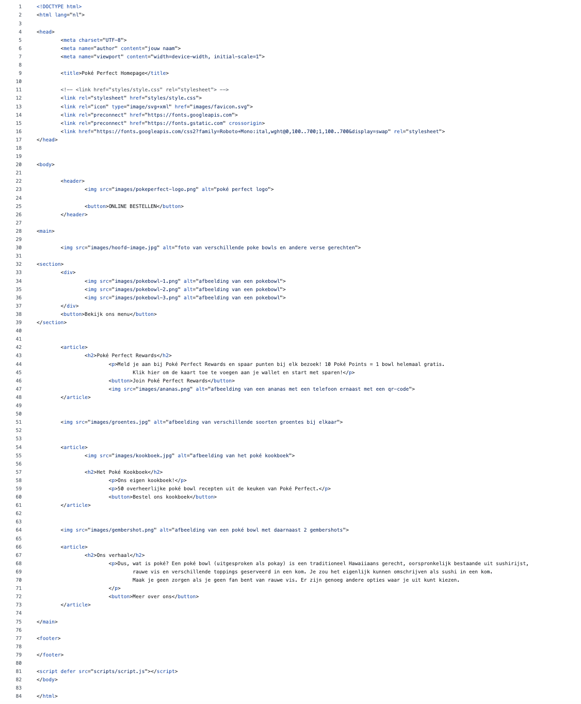

  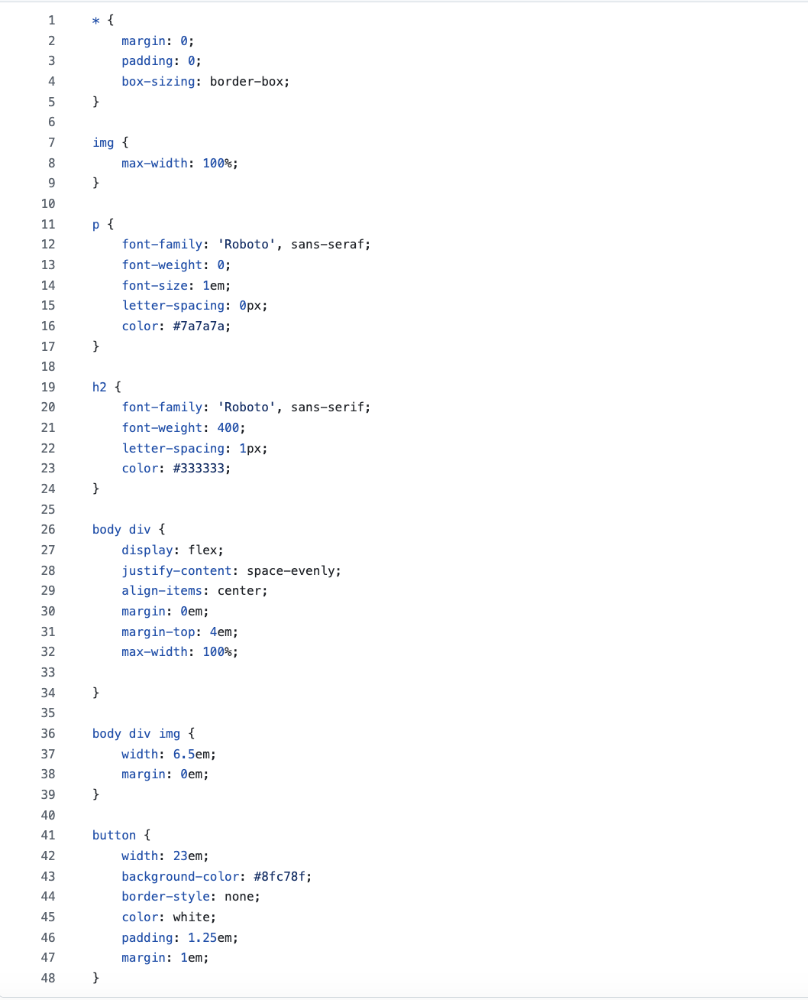

  ### Agenda voor meeting
  samen met je groepje opstellen

  | student 1      | student 2          | student 3    | student 4        |
  | ---            | ---                | ---          | ---              |
  | dit bespreken  | en dit             | en ik dit    | en dan ik dat    |
  | en dat ook nog | dit als er tijd is | nog een punt | dit wil ik zeker |
  | ...            | ...                | ...          | ...              |

Vragen die ik wil stellen:
- Moet je exact hetzelde navigatie menu maken als bij je gekozen website of mag je hierin afwijken?
- Wat is het verschil tussen div en span?
- Mijn website beweegt op desktop formaat als het ware 'over' de achtergrond heen, moet ik dit per se namaken op die manier?

  ### Verslag van meeting
  hier na afloop snel de uitkomsten van de meeting vastleggen

De bovenstaande vragen en het antwoord:
  - Nee dat hoeft niet, je mag zelf kiezen wat voor nav menu je maakt, als je maar oefent met nieuwe skills en niet een simpel navigatie menu maakt zonder flexbox, javascript of grid.
  - 
 gebruik je op bloklevel: je krijgt de elementen onder elkaar te zien staan
     gebruik je inline: je krijgt de elementen naast elkaar te zien staan
  - Dit hoeft niet per se, kan wel leuk zijn het is niet heel ingewikkeld.

## Toegankelijkheidstest 2/2 (week 4)

  
uitwerken na test in 9e werkgroep

  ### Bevindingen
  Lijst met je bevindingen die in de test naar voren kwamen:
De website scoorde over het algemeneen wel goed, wel waren er een aantal errors bij het valideren van de html. 
De punten waarop Poké Perfect niet goed scoorde waren:
- html bevatte errors
- De focus state kwam niet oevreen met de stijl van de website en was slecht zichtbaar
- De homepage bevat geen h1
- Images bevatten vaak geen alt
- De images met tekst erop (co2 hoeveelheid) bevatten geen alt attribute die deze informatie weergaf 
- Er is een carousel van afbeeldingen die automatisch afspeelt, deze kan niet op pauze
- Links zijn niet herkenbaar als links
- De site gebruikt bijna nooit een button element voor knoppen, meestal een opgemaakte a link
- Geen skip-link bij focus state
- Geen darkmode
- Geen high-contrast mode
- Animaties bevatten geen prefers-reduced-motion media query
- Geen gebruik van ::selection colors

## Voortgang 3 (week 4)

  
uitwerken voor 3e voortgang

  ### Stand van zaken
  Ik heb enorm veel progressie geboekt afgelopen week, beide html pagina's zijn al bijna af. Ik heb een hamburger menu gemaakt en ben zelfs al begonnen met het oefenen van grid en responsiveness op mijn eigen website! Enorm veel geleerd afgelopen week, ben erg tevreden.

  Code momenteel: 

  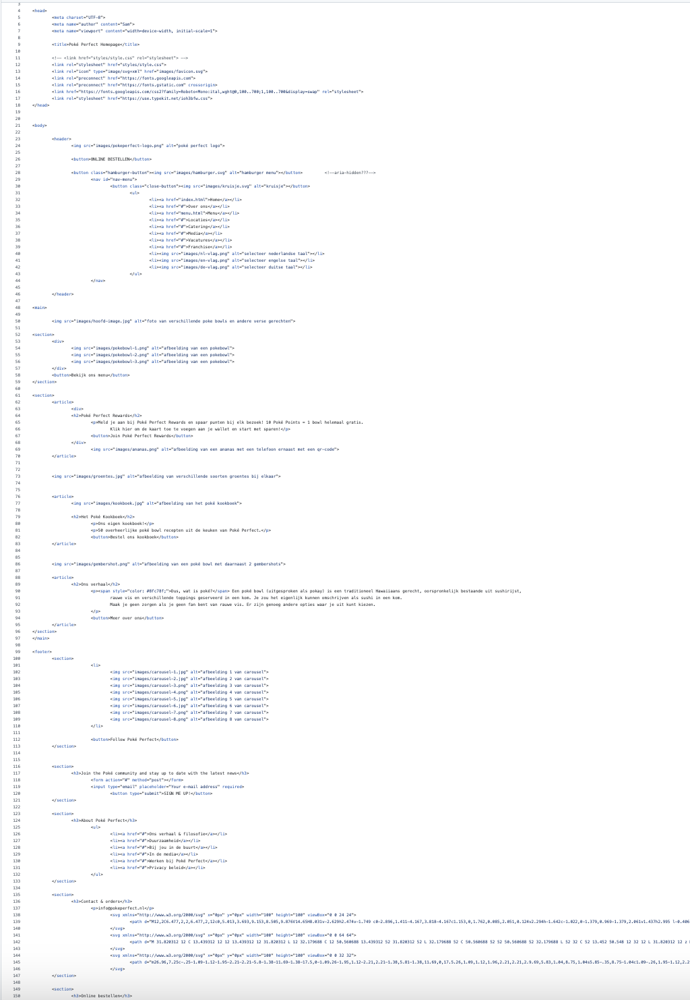

  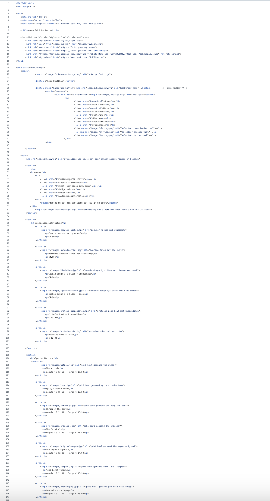

  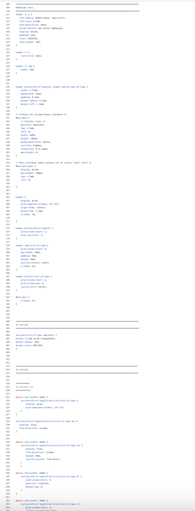

  ### Agenda voor meeting
  samen met je groepje opstellen

  | student 1      | student 2          | student 3    | student 4        |
  | ---            | ---                | ---          | ---              |
  | dit bespreken  | en dit             | en ik dit    | en dan ik dat    |
  | en dat ook nog | dit als er tijd is | nog een punt | dit wil ik zeker |
  | ...            | ...                | ...          | ...              |

Vragen die ik wil stellen?
- Ik heb nu wel classes/id bij mijn hamburger menu, kan dit wel zonder?
- Hoe kan ik een plaatje als het ware bijsnijden?
- Moet een image op een vaste plek binnen een article staan in verband met semantische code?

  ### Verslag van meeting
  hier na afloop snel de uitkomsten van de meeting vastleggen

  De bovenstaande vragen en het antwoord:
  - Ja dit kan gewoon, ik heb het nu zonder gedaan en daarnaast ook gebruik gemaakt van de attribute selector. Ik kende dit eerst nog niet maar het kan enorm handig zijn.
  - Dit kan met de property object-fit en dan de waarde 'cover,' vervolgens stel je de hoogte of breedte van de afbeelding in en wordt de rest als het ware afgesneden.
  - Nee, dit is in principe netter maar is niet nodig en zeker niet de moeite waard om nu nog aan te passen.

## Eindgesprek (week 5)

  
uitwerken voor eindgesprek

  ### Je uitkomst - karakteristiek screenshots:
  
  Menu pagina op desktop scherm:
  

Homepage op iphone scherm:
  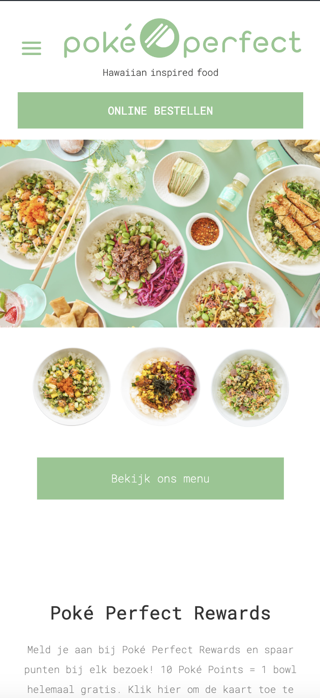

Specialiteiten section op brede weergave met grid:
  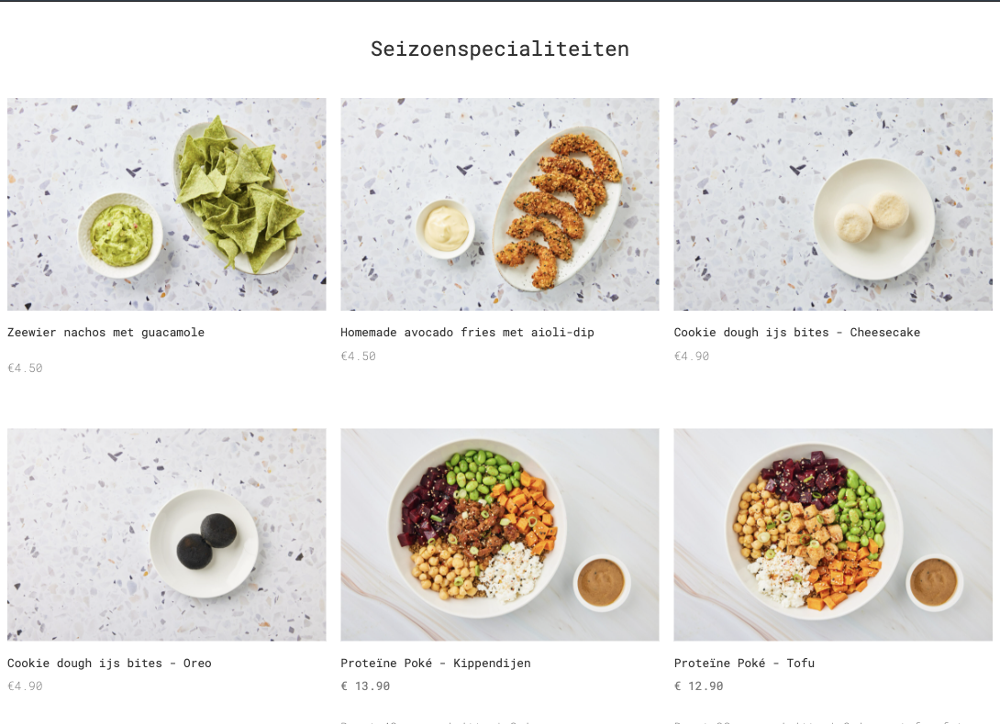

Footer op ipad scherm:
  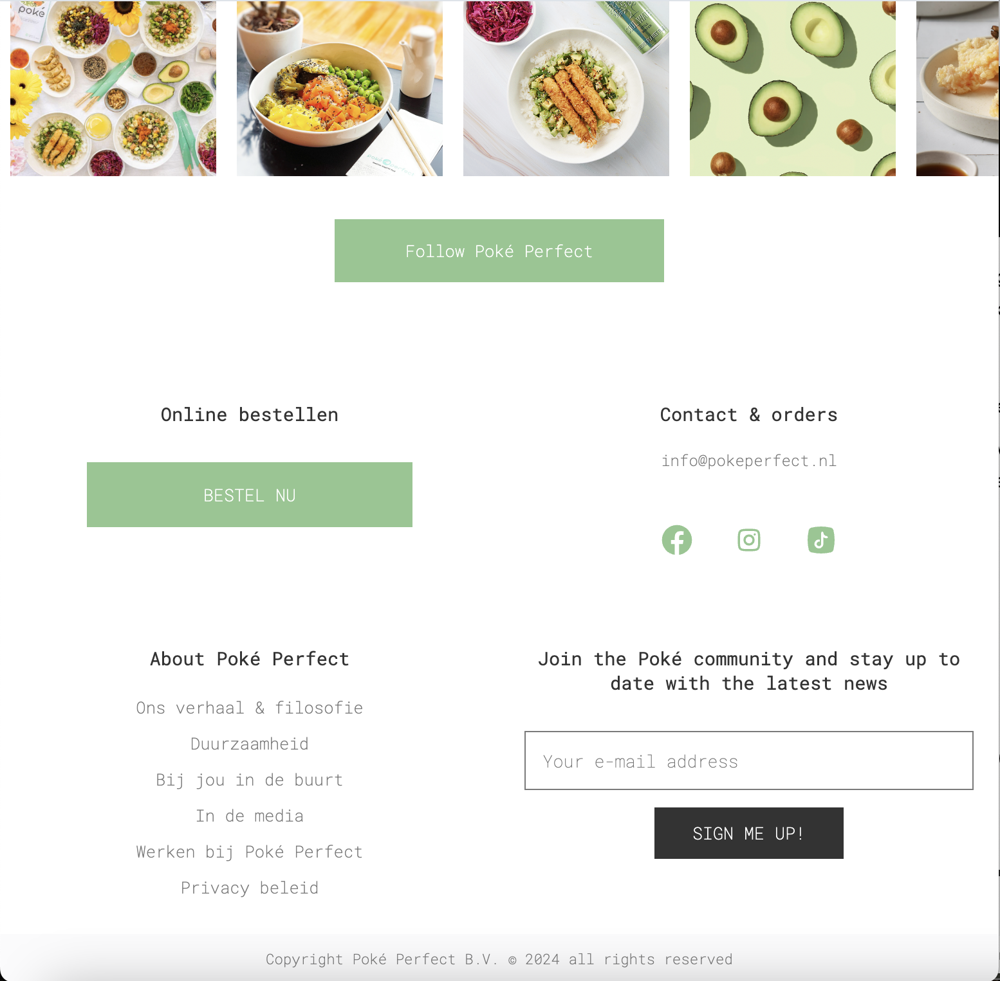

Homepage article responsive met grid:
  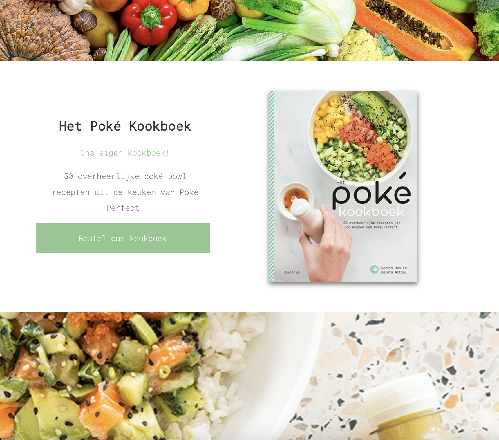

  ### Dit ging goed/Heb ik geleerd: 
  Eigenlijk ben ik heel tevreden over het algemeen en heb ik enorm veel geleerd. Ik ben vooral trots op de responsiveness van mijn website, dit heb ik nooit eerder gedaan en wilde dit graag leren, ik ben blij dat ik mijn focus hierop heb gelegd. Ook ben ik heel blij met het hamburger menu, ik heb hem niet alleen laten werken maar ook zo kunnen stylen dat hij vrijwel 1:1 is met die van Poké Perfect! 

Hamburgermenu van mijn website:
  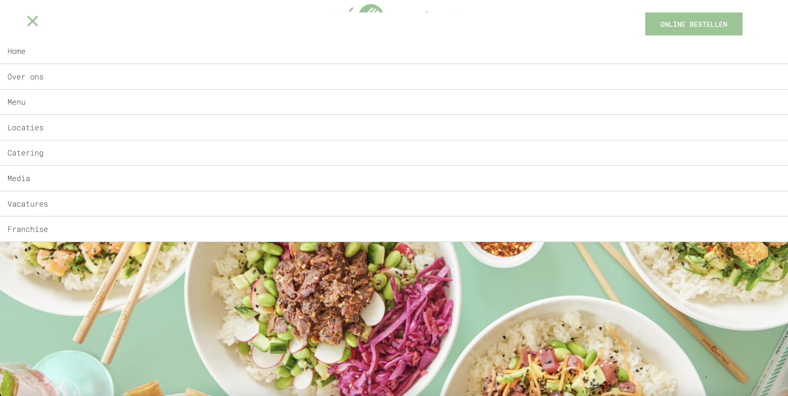

Voorbeeld van het toepassen van grid:
  

  ### Dit was lastig/Is niet gelukt:
  Het meeste wat ik wilde maken is wel goed gelukt, maar de originele website heeft iets bijzonders dat ik niet heb. De pagina met content beweegt als het ware over de achtergrond afbeelding heen, bij mij is dit niet gelukt. Dit komt voornamelijk door een te kort aan tijd waardoor ik dit niet als eerste prioriteit zag, dus wie weet bij een volgende opdracht. Daarnaast waren er een aantal kleine details waar ik niet helemaal tevreden over was, waaronder een witruimte tussen de eerste image en de eerste section op de menu pagina. Ik kreeg deze ruinmte niet weg, wat ik ook deed. Omdat ik ook enigszins in tijdnood kwam kon ik hier ook niet verder naar onderzoeken, toch net jammer.

Hier de menu pagina met ongewenste witruimte:
  

## Bronnenlijst

  
continu bijhouden terwijl je werkt

  Nb. Wees specifiek ('css-tricks' als bron is bijv. niet specifiek genoeg). 
  Nb. ChatGpT en andere AI horen er ook bij.
  Nb. Vermeld de bronnen ook in je code.

  1. bron 1
  2. bron 2
  3. ...

